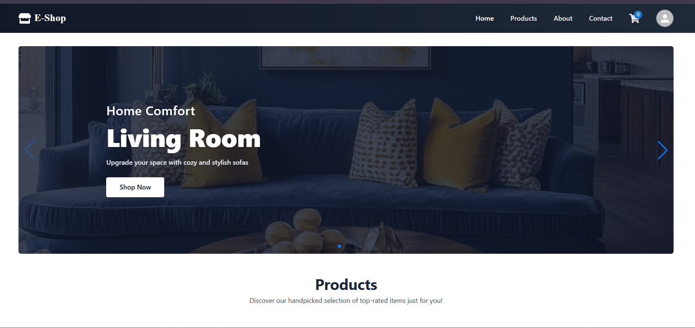
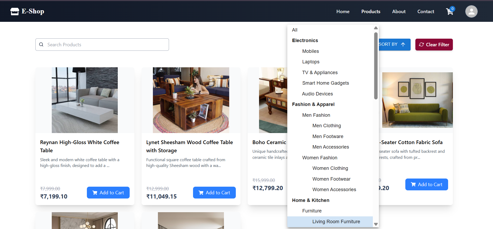
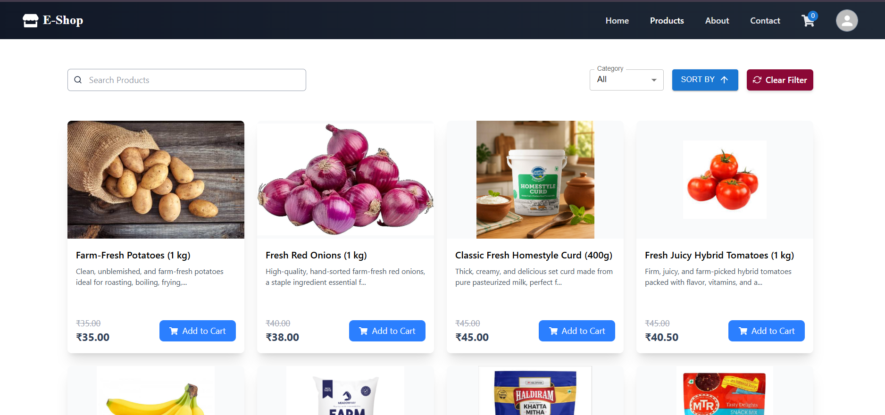
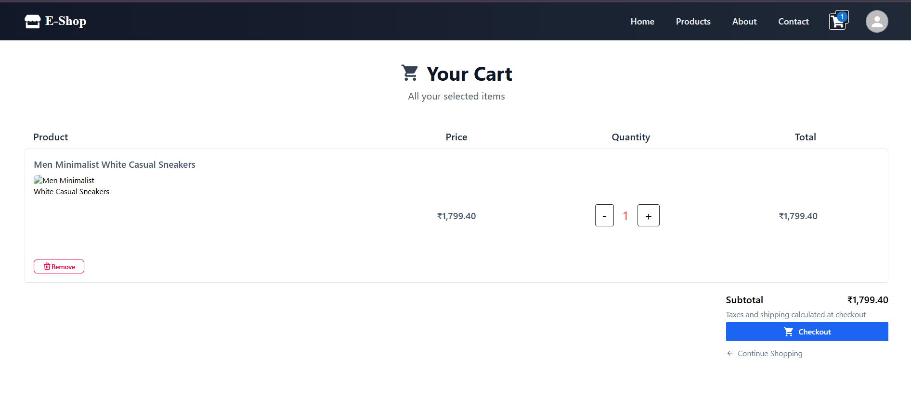
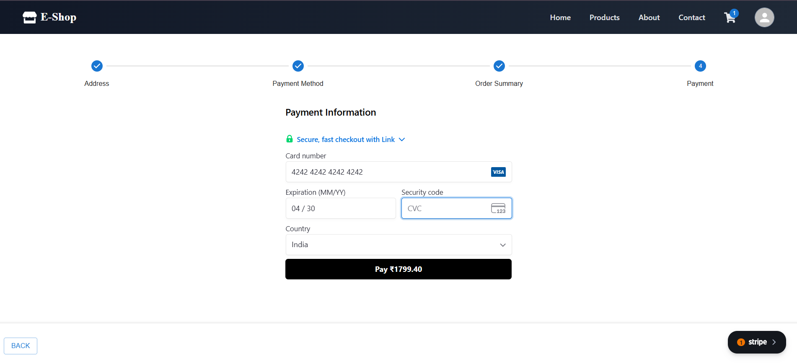
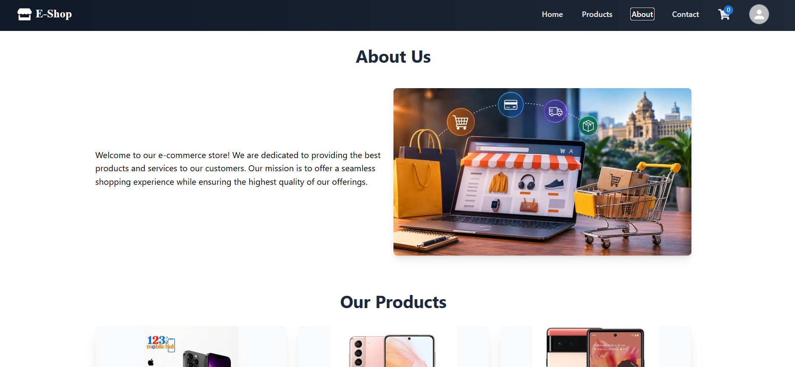
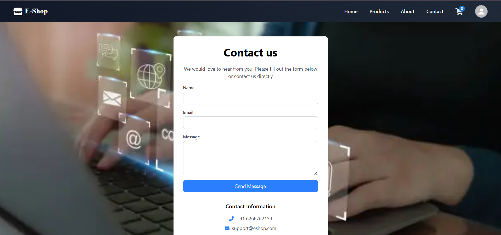

# E-Shop & Multi-Category Platform

A robust, full-stack enterprise-grade e-commerce and multi-category management platform built with a **React (Vite)** frontend and a **Spring Boot** REST API backend. It features secure JWT authentication, role-based access control, integrated payment processing (Stripe & PayPal), file management, and advanced analytics.

---

## Application Overview & Homepage

<div align="center">
  
  <p><em>Home page featuring dynamic category banners and product highlights.</em></p>
</div>

---

## Comprehensive Catalog Categories & Navigation

The platform supports a deeply nested multi-category inventory matrix structured across major verticals, complete with an interactive category dropdown menu:

<div align="center">
  
  <p><em>Multi-level category dropdown supporting seamless user navigation.</em></p>
</div>

* **Electronics**
  * Mobiles, Laptops, TV & Appliances, Smart Home Gadgets, Audio Devices
* **Fashion & Apparel**
  * **Men Fashion**: Men Clothing, Men Footwear, Men Accessories
  * **Women Fashion**: Women Clothing, Women Footwear, Women Accessories
* **Home & Kitchen**
  * **Furniture**: Living Room Furniture, Bedroom Furniture, Office Furniture
  * **Kitchen & Dining**: Cookware & Bakeware, Dinnerware & Tabletop, Kitchen Storage
  * **Home Decor**: Lighting & Lamps, Wall Art & Paintings, Rugs & Carpets, Clock & Mirrors
* **Sports, Fitness & Outdoors**
  * Fitness Equipment, Team Sports, Outdoor Recreation
* **Health, Food & Groceries**
  * **Groceries**: Fresh Fruits & Vegetables, Dairy & Eggs, Rice, Flour & Grains
  * **Health & Wellness**: Vitamins & Supplements, Personal Care, Packaged Foods & Snacks
* **Books & Stationery**
  * **Books**: Fiction & Literature, Academic & Textbooks, Children's Books
  * **School & Office Supplies**: Notebooks & Diaries, Pen & Pencils, Desk Organizers
  * Art & Craft Supplies

---

## Product Showcase & Filtering

<div align="center">
  
  <p><em>Product catalog displaying electronics with pricing and inventory actions.</em></p>
</div>

<div align="center">
  
  <p><em>Dynamic product filtering and sorting interface for groceries and essentials.</em></p>
</div>

---

## Cart & Checkout Experience

<div align="center">
  
  <p><em>Shopping cart management view calculating item totals and quantities.</em></p>
</div>

<div align="center">
  
  <p><em>Secure multi-step checkout pipeline supporting payment gateway integrations.</em></p>
</div>

---

## About & Customer Support

<div align="center">
  
  <p><em>About Us section detailing store mission and background.</em></p>
</div>

<div align="center">
  
  <p><em>Interactive Contact Us modal providing direct support channels and inquiry forms.</em></p>
</div>

---

## Project Structure & Architecture

### Frontend Architecture (`ecom-frontend`)
* **`src/components/admin/`**: Administrative modules covering category management, dashboard stats, order tracking, product inventories, and seller oversight via `AdminLayout.jsx`.
* **`src/components/auth/`**: Authentication interfaces including `Login.jsx` and `Register.jsx`.
* **`src/components/cart/`**: Cart management components (`Cart.jsx`, `CartEmpty.jsx`, `ItemContent.jsx`, `SetQuantity.jsx`).
* **`src/components/checkout/`**: Multi-step checkout pipeline supporting dynamic address book management, order summaries, and payment gateways (`StripePayment.jsx`, `PaypalPayment.jsx`).
* **`src/components/home/`**: Landing page layout elements including hero banners and featured content sections.
* **`src/components/products/`**: Dynamic product catalog and filter matrix (`Filter.jsx`, `Products.jsx`).
* **`src/components/shared/`**: Reusable core components such as navigation bars, sidebars, modals (`DeleteModal.jsx`, `Modal.jsx`), input fields, loaders, and pagination.
* **`src/store/`**: State management containers handling actions and reducers.

### Backend Architecture (`SpringBoot-ecom`)
* **`com.ecommerce.project.config`**: Core configuration classes for application beans, constants, Swagger/OpenAPI documentation, and WebMvc resource mappings.
* **`com.ecommerce.project.controller`**: REST controllers exposing endpoints for addresses, analytics, authentication, shopping carts, categories, orders, and products.
* **`com.ecommerce.project.exceptions`**: Global exception handler alongside custom exceptions (`APIException`, `ResourceNotFoundException`).
* **`com.ecommerce.project.model`**: JPA Entity models mapping relational structures for `User`, `Role`, `Category`, `Product`, `Cart`, `CartItem`, `Order`, `OrderItem`, `Payment`, and `Address`.
* **`com.ecommerce.project.payload`**: Data Transfer Objects (DTOs) and response wrappers separating internal data layers from API contracts.
* **`com.ecommerce.project.repositories`**: Spring Data JPA interfaces for database persistence operations.
* **`com.ecommerce.project.security`**: Security configuration, JSON Web Token (JWT) filters, authentication entry points, and request/response security definitions.
* **`com.ecommerce.project.service`**: Business logic implementations for all domain modules, including Stripe payment processing and local/remote file services.

---

## Key Features

* **Multi-Category Architecture**: Scalable catalog structure supporting diverse product departments and subcategories.
* **Secure Authentication & Authorization**: Token-based security workflow using JSON Web Tokens (JWT) with encoded role definitions (`AppRole`, `Role`).
* **Comprehensive Cart & Order Pipeline**: Real-time cart calculations, inventory validation, and structured order state transitions.
* **Flexible Payment Gateway Integration**: Built-in support for Stripe and PayPal checkout flows.
* **Administrative Control Center**: Dedicated admin dashboard sections for tracking system analytics, managing catalogs, and overseeing fulfillment statuses.

---

## Tech Stack

* **Frontend**: React (Vite), React Router, Context API / Redux State Store, Modern CSS.
* **Backend**: Java, Spring Boot, Spring Security, Spring Data JPA (Hibernate).
* **Database & Storage**: MySQL database backend, local file directory asset storage.
* **API Documentation**: Swagger / OpenAPI integration.

---

## Getting Started

### Prerequisites
* Node.js & npm (for frontend execution)
* Java Development Kit (JDK 17+)
* Maven
* MySQL Server

### Frontend Setup
1. Navigate to the frontend directory(ecom-frontend).
2. Install project dependencies:
   ```bash
   npm install
3. Run the development server:
   ```bash
   npm run dev

### Backend Setup
1. Clone the repository and navigate to the backend directory.
2. Configure the database parameters and Stripe secret keys inside `src/main/resources/application.properties`.
3. Build and run the Spring Boot application using Maven:
   ```bash
   mvn spring-boot:run
